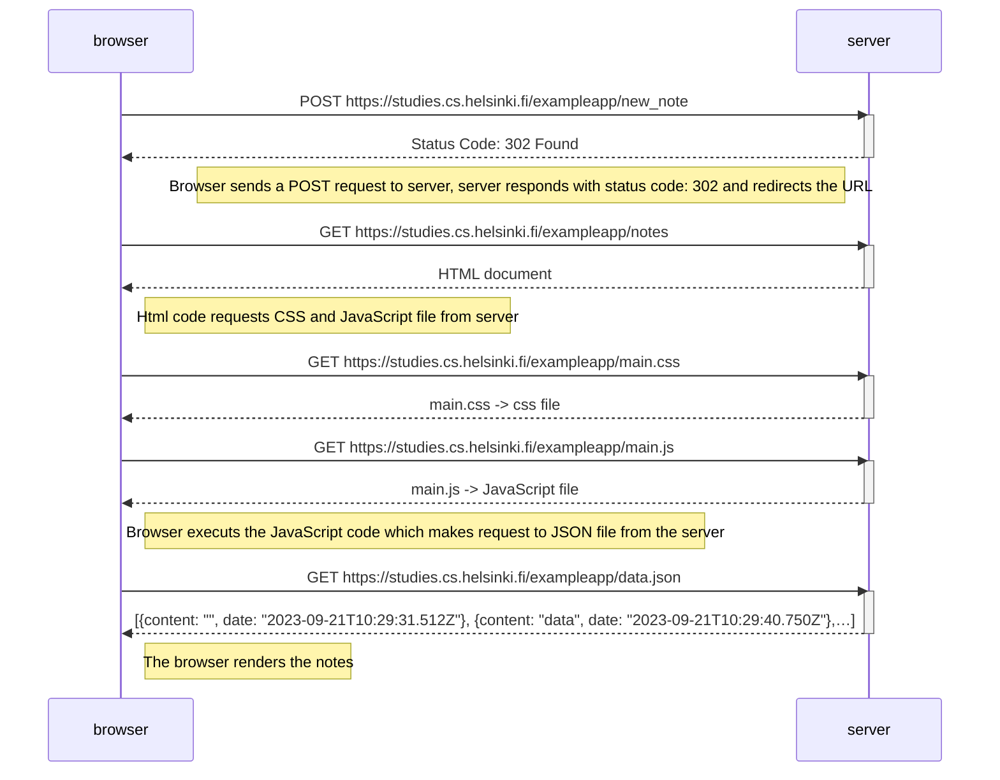

```mermaid
sequenceDiagram
    participant browser
    participant server

    browser->>server: POST https://studies.cs.helsinki.fi/exampleapp/new_note
    activate server
    server-->>browser:Status Code: 302 Found
    deactivate server

    Note left of server: Browser sends a POST request to server, server responds with status code: 302 and redirects the URL

    browser->>server: GET https://studies.cs.helsinki.fi/exampleapp/notes
    activate server
    server-->>browser: HTML document
    deactivate server

    Note right of browser: Html code requests CSS and JavaScript file from server

    browser->>server: GET https://studies.cs.helsinki.fi/exampleapp/main.css
    activate server
    server-->>browser: main.css -> css file
    deactivate server

    browser->>server: GET https://studies.cs.helsinki.fi/exampleapp/main.js
    activate server
    server-->>browser: main.js -> JavaScript file
    deactivate server

    Note right of browser: Browser executs the JavaScript code which makes request to JSON file from the server

    browser->>server: GET https://studies.cs.helsinki.fi/exampleapp/data.json
    activate server
    server-->>browser: [{content: "", date: "2023-09-21T10:29:31.512Z"}, {content: "data", date: "2023-09-21T10:29:40.750Z"},…]
    deactivate server

    Note right of browser: The browser renders the notes
```
