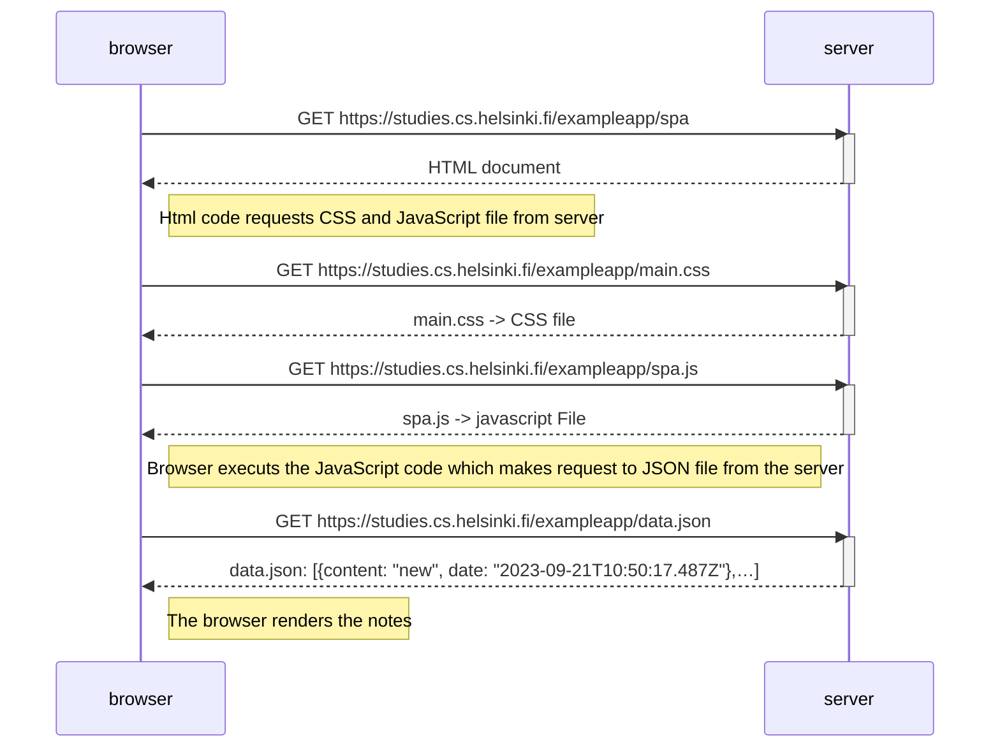

```mermaid
sequenceDiagram
    participant browser
    participant server

    browser->>server: GET https://studies.cs.helsinki.fi/exampleapp/spa
    activate server
    server-->>browser: HTML document
    deactivate server

    Note right of browser: Html code requests CSS and JavaScript file from server

    browser->>server: GET https://studies.cs.helsinki.fi/exampleapp/main.css
    activate server
    server-->>browser: main.css -> CSS file
    deactivate server

    browser->>server: GET https://studies.cs.helsinki.fi/exampleapp/spa.js
    activate server
    server-->>browser: spa.js -> javascript File
    deactivate server

    Note right of browser: Browser executs the JavaScript code which makes request to JSON file from the server

    browser->>server: GET https://studies.cs.helsinki.fi/exampleapp/data.json
    activate server
    server-->>browser: data.json: [{content: "new", date: "2023-09-21T10:50:17.487Z"},…]
    deactivate server

    Note right of browser: The browser renders the notes
```
